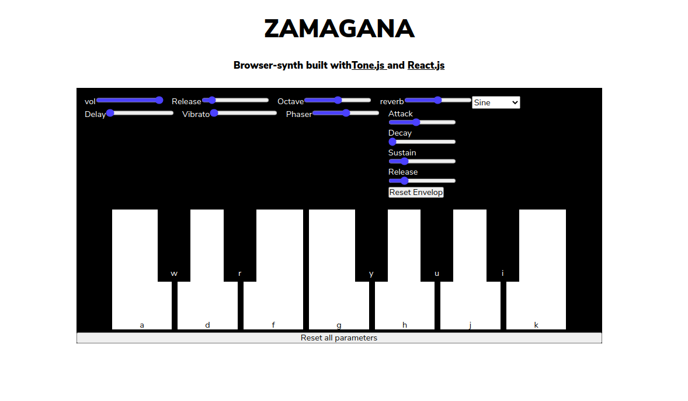

# Zamagana Synth

#### a project by Marcelo, Zakaria, Nathan and Gabriela

## Main task division

- Marcelo: CSS
- Zakaria: React/JS
- Nathan: React/JS
- Gabriela: Project Management

## Features

- volume slider
- reset all parameters
- choose octave
- reverb controller
- delay controller
- phaser controller
- release controller
- vibratto controller
- wave form controller
- envelop controller
- new sound recording (eventually)
- open new window with further options (eventually)
- user should be able to change the key's assignment(eventually)

- Zsynth (contains the effects imported from the library tone.js)

```
  // Delay

  let zDelay = new Tone.FeedbackDelay({
    maxDelay: zDel.maxDelay,
    feedback: zDel.feedback,
  }).toMaster();

  // Reverb

  let zReverb = new Tone.JCReverb({
    roomSize: props.zRev.roomSize,
  }).toMaster();

  // Pahser

  let Zphaser = new Tone.Phaser({
    frequency: zPhs.frequency,
    octaves: zPhs.octaves,
    stages: zPhs.stages,
    Q: zPhs.Q,
    baseFrequency: zPhs.baseFrequency,
  }).toMaster();

  // Vibrato

  let Zvibrato = new Tone.Vibrato({
    frequency: zVib.frequency,
    depth: zVib.depth,
  }).toMaster();

  /*
   * assigning the Imported Synth to a the variable zsynth
   * assigning values to its oscillator & envelop from the state
   * connect the the effects to the synth using .chain() methode
   */

  let zsynth = new Tone.Synth({
    volume: zVol,
    oscillator: { type: zOsc },
    envelope: {
      attack: zEnv.attack,
      decay: zEnv.decay,
      sustain: zEnv.sustain,
      release: zEnv.release,
    },
  }).chain(zDelay, Zvibrato, Zphaser, zReverb);

```

## Interface

- keyboard-looking keys
- volume slider
- reset all parameters button
- choose octave slider
- controller sliders:
  - reverb controller
  - delay controller
  - phaser controller
  - release controller
  - vibratto controller
- envelop controller
  - attack slider
  - decay slider
  - sustain slider
  - release slider
  - reset button
- reset all parameters button
- wave form controller menu
- choose Synth type menu (evtl)



## Technologies

- [ToneJs Library](https://tonejs.github.io/)
- [React keyboard event handler](https://www.npmjs.com/package/react-keyboard-event-handler)

## References

- [Learning Music Ableton](https://learningmusic.ableton.com/)
- [MDN Simple Synth](https://developer.mozilla.org/en-US/docs/Web/API/Web_Audio_API/Simple_synth)
- [JS Piano Keyboard](https://www.freecodecamp.org/news/javascript-piano-keyboard/)
- [MDN Web Audio API](https://developer.mozilla.org/en-US/docs/Web/API/Web_Audio_API)

## Project Structure

```

Project
│
│ README.md
| .gitignore
│ package.json
| package-lock.json
│
│
└───src
│   └───components
│   │    └───Zkey
│   │    └───Zsynth
│   │    └───controllers
│   │           └───controllers
│   │                └───controllers
│   │                │     └───ZenvelopController.js
│   │                └───Zcontrols (renders all other controllers)
│   │                └───ZdelayController.js
│   │                └───ZOctaveController.js
│   │                └───ZphaserController.js
│   │                └───ZreleaseController.js
│   │                └───ZreverbController.js
│   │                └───ZvibratoController.js
│   │                └───ZvolumeController.js
│   │                └───ZwaveFormController.js
│   │
│   │
│   └───App.js
│   └───index.js
│   └───helpers.js
│   └───scss
│   │     └───main
│   │     └───_base.scss
│   │     └───_controls.scss
│   │     └───_keyboard.scss
│   │     └───_normalize.scss
│   └───notes.json
│   └───defaultParameters.json
│
│
└───public
     └───index.html

```

## Progress
